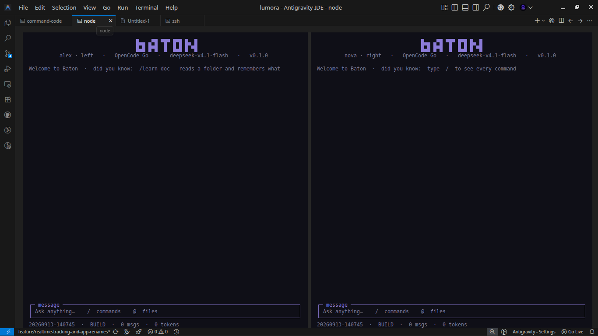

# Baton

**Your own AI coding agent — two of them, in one terminal, handing work to each other.**

Baton is not a wrapper around another CLI. It is its own agent: you pick a model provider,
paste your API key, and talk to it. Install two of them side by side and they pass work
back and forth instead of you relaying by hand.

- **No provider SDK, no other agent CLI.** Baton talks to the provider's HTTP API directly.
- **Bring your own key.** Command Code, OpenCode Zen/Go, Claude, OpenAI, DeepSeek,
  Kimi/Moonshot, Gemini, OpenRouter, Groq, xAI, Mistral, or a local Ollama/LM Studio.
- **It can actually code** — read/write/edit files, glob, grep, run shell commands.
- **Two sides, two setups.** Left pane and right pane can each use a different provider,
  key and model.



## What Baton solves

Working with two AI agents normally makes **you** the messenger: copy the error out of one
chat, paste it into the other, copy the answer back, repeat. You lose the context, the file
the first agent just touched, and your own attention.

Baton takes you out of the middle:

- **The agents hand work to each other.** A local relay (an append-only log plus a small
  daemon) lets one side send a handoff, question or error to the other and get an answer,
  with a hop cap so it can never loop. This is the difference from just opening two
  terminals: they actually pass the work.
- **You stay in charge.** Both conversations are on screen at once — step in whenever you
  want, or let them continue. `ctrl+o` opens the full-screen transcript of the conversation
  without the input box in the way.
- **One tool, your own keys.** No second CLI and no vendor lock-in: pick a provider, paste
  a key, and both panes are your own agents, each with its own name (`Nova · left`,
  `Rex · right`) and model.
- **It works on the real project.** The agent reads, edits and runs things in your working
  directory, and each project keeps its own sessions and its own relay traffic.

## Install

Requires **Node.js >= 22.6** (Baton runs TypeScript directly — no build step, no runtime
dependencies).

```bash
npm install -g .          # from a checkout
bash scripts/install.sh   # or: install + optional terminal multiplexer
```

## First run

```bash
baton
```

1. It checks node and the terminal, and installs a multiplexer if you want panes
   (**no sudo** — tmux is unpacked into `~/.baton/bin`).
2. It opens an **interactive setup**: a list you drive with **↑/↓ and Enter** (type to
   filter, `esc` to cancel), one box per step —

   ```
   choose a provider
   ──────────────────────────────────────────────
   recommended
   ❯ Command Code            anthropic  needs key
     OpenCode Zen            openai     needs key
     OpenCode Go             openai     needs key
     Claude (Anthropic)      anthropic  needs key
   frontier models
     OpenAI                  openai     needs key
   ...
   ──────────────────────────────────────────────
   ↑/↓ move · type to filter · enter select · esc cancel
   ```

   For known providers the **base URL is built in** — you never type it; the next box just
   asks for your key. Then it **fetches the model list from that provider** so you pick
   from a second arrow-key list.
3. It asks whether the right side should use a different provider/model, then launches:
   **left pane and right pane, both running Baton's own agent.**

Re-running `baton` attaches to what is already running. `baton kill` stops everything.

```
baton                   set up + launch (--no-start, --yes, --force)
baton chat              talk to the agent here (--agent, --provider, --model, --session)
baton ask "…"           one-shot headless run (--yes to allow tools)
```

Sessions are kept **per project** — `/sessions` lists the ones recorded in the current
working directory, so a new project starts with a clean list. `ctrl+d` deletes the selected
session, but not the one you are currently in (switch away first).

## The interface

`baton chat` opens Baton's **own full-screen terminal UI**, built on
[OpenTUI](https://opentui.com) — the same native Zig renderer OpenCode uses. Not a
scrolling list: an alternate-screen app with a block **BATON** wordmark, a bordered
`conversation` panel that scrolls, a bordered `ask anything` input with a real cursor, and
a status footer.

```
        █▄▄ ▄▀█ ▀█▀ █▀█ █▄ █
        █▄█ █▀█  █  █▄█ █ ▀█

                    oc · OpenCode Go · deepseek-v4.1-flash

  ┌─ conversation ──────────────────────────────────────────────┐
  │ › refactor the auth module                                  │
  │ -> read_file src/auth.ts                                    │
  │ I moved the token check into verifyToken()...               │
  └─────────────────────────────────────────────────────────────┘
  ┌─ ask anything ──────────────────────────────────────────────┐
  │ ❯ _                                                         │
  └─────────────────────────────────────────────────────────────┘
  enter send · /help commands · ctrl+c quit · /home/you/project
```

Type a request and press Enter. `/help` lists the slash commands. Tool calls stream in as
they happen. `baton up` puts two of these side by side — left and right, each with its own
provider, key and model.

Requirements for the full-screen UI: **Node 26.4+** (OpenTUI's native core needs FFI).
Baton re-execs itself with `--experimental-ffi` automatically. On older Node, or if the
native library cannot load, it prints why and falls back to the plain text chat.

## Providers

```bash
baton providers                     # what is available, and whether a key is set
baton key deepseek sk-…             # save a key (written to ~/.baton/keys.json, chmod 600)
baton models --provider deepseek    # list models straight from the provider
baton providers --json
```

The picker groups them:

- **recommended** — Command Code · OpenCode Zen · OpenCode Go · Claude (Anthropic)
- **frontier models** — OpenAI · Google Gemini · xAI (Grok) · Mistral · Perplexity
- **open models (fast + cheap)** — DeepSeek · Kimi (Moonshot) · Groq · Together AI ·
  Fireworks AI · Cerebras · DeepInfra · SiliconFlow · Z.ai (GLM) · Alibaba DashScope (Qwen)
- **gateways / routers** — OpenRouter · Vercel AI Gateway · LiteLLM (your own proxy)
- **local (no key)** — Ollama · LM Studio · vLLM
- **something else** — *Custom endpoint*

Picking **Custom endpoint** asks for the **name, base URL, format (openai/anthropic) and
key** — it is saved into `config.json` and appears in the menu next time, so you only
describe it once.

Wire format: Command Code and Claude use **anthropic**; everything else is **openai**
(chat-completions compatible). Base URLs are built in and displayed in the menu; keys live
in `~/.baton/keys.json` (mode 600) with environment variables as a fallback
(`DEEPSEEK_API_KEY`, `ANTHROPIC_API_KEY`, …).

## Slash commands

Inside `baton chat`:

| Command | What it does |
|---------|--------------|
| `/help` | list everything |
| `/status` | agent, provider, model, key, session, tool policy |
| `/model [name]` `/models` | show/switch the model, or list the provider's models |
| `/provider [id]` `/key <p> <k>` | switch provider, save a key |
| `/yes` | toggle auto-approve for tools |
| `/clear` `/resume [id]` | conversation history |
| `/remember <text>` `/context` | memory |
| `/cost` | price the next request |
| `/send <to> [type] <text>` `/inbox` | the relay to the other agent |
| `/update` | update baton itself |
| `/quit` | leave |

## Tools

`read_file` · `write_file` · `edit_file` · `list_dir` · `glob` · `grep` · `shell`

Writes and shell commands ask for confirmation unless you run with `--yes` or toggle
`/yes`.

## The two-agent relay

The second job. Two Baton agents (the two panes) hand work to each other over a local
relay — append-only log, long-poll daemon, hop cap so nothing loops, MCP server for native
tool access. See `adapters/AGENTS.md` for the protocol, and `baton console` for the relay
control view.

```bash
baton console     # slash commands: /send /inbox /model /cmd /run /kill
baton cmd <agent> model=deepseek-chat
baton status / log / logs / kill
```

## Config (`~/.baton/config.json`)

Each agent has a unique `name` and a `role` (`left` / `right`, the pane it lives in). You can
address it by either — `baton send --to Nova` or `baton send --to left`. A fresh config names them Nova (left) and Rex (right); an older
config still named "left"/"right" asks for a name inside the app on the next launch.

```json
{
  "agents": [
    { "name": "Nova", "role": "left",  "provider": "command-code", "model": "claude-sonnet-4-6" },
    { "name": "Rex",  "role": "right", "provider": "deepseek",     "model": "deepseek-chat" }
  ],
  "defaultProvider": "command-code",
  "defaultModel": "claude-sonnet-4-6",
  "autoApprove": false,
  "port": 7331,
  "maxHop": 8
}
```

An agent with no `command` runs Baton's own agent. An agent with a `command` launches that
CLI instead — so you can still point a pane at any external tool if you want.

## Status

Working: own agent (OpenAI + Anthropic wire formats), streaming, tool loop, provider
registry, key store, model fetching, provider wizard, tmux/Windows Terminal/WezTerm/PTY
launcher, relay (log + daemon + MCP), memory, attachments, cost router, port probe,
guardrails.

Not yet: a full-screen TUI (the chat is line-based), a `/` command palette popup, and
`/update` needs the package published to npm.

## License

MIT
